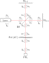
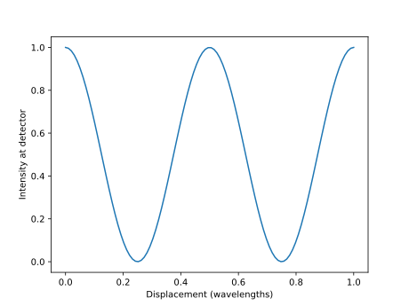
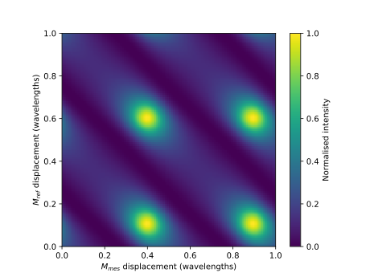

Getting started
=================================

`scampy` was designed primarily for modelling displacement measuring optical
interferometers. This guide is intended to give a brief introduction to using
`scampy` for modelling a simple Michelson interferometer, shown in figure 1, and
should provide a starting point for modelling other more complex optical
systems. Python scripts implementing the example described here may be found in
the `examples` folder of the `scampy` GitHub repository. To run this example code
`matplotlib` will need to be installed (:code:`pip install matplotlib`). Further
examples can be found in the `tests` folder.

    Figure 1: schematic of a simple Michelson interferometer with nodes used for
    `scampy` modelling labeled. Beam splitter, `BS`; reference mirror `Mref`;
    moving measurement mirror `Mmes`; linear polariser `Pol`; photodiode `PD1`.

As can be seen in figure 1, `scampy` describes optical systems as a network of
interconnected nodes. The interferometer shown is linked together with 10 nodes,
with counter propagating electric field components defined at each node.

Once installed scampy, along with the numpy and matplotlib libraries, can be
imported, and an empty model initialised with ::

    import numpy as np
    from matplotlib import pyplot as plt
    import scampy

    model = scampy.Model()

The `Model` instance defines the structure of the optical network to modelled 
All models must have at least one source of light, which can be added with the
`scampy.Model.Model.add_component` method ::

    model.add_component(scampy.components.Source, 'laser', 'n0')

When adding a component, a unique name (in the above example `laser`) and the
node, or nodes, to which the compoent is attached must be specified. In this
case the source has been connected to a node named `n0`. For components that
connect to multiple nodes a tuple of node names should be specified, for example
in the case of the beam splitter component in figure 1 ::

    model.add_component(scampy.components.BeamSplitter, 'BS', ('n1', 'n2', 'n3', 'n4'))

Similarly, the other components can be added with ::

    model.add_component(scampy.components.Mirror, 'Mmes', 'n5')
    model.add_component(scampy.components.Mirror, 'Mref', 'n6')
    model.add_component(scampy.components.Polariser, 'pol', ('n7', 'n8'))

All components in `scampy` must be linked together with transfer matrix
components, in the majority of cases this linking component will be a
`scampy.components.Stack`. For the interferometer in figure 1, the following
stacks will link all components ::

    model.add_component(scampy.components.Stack, 's01', ('n0', 'n1'))
    model.add_component(scampy.components.Stack, 's35', ('n3', 'n5'))
    model.add_component(scampy.components.Stack, 's26', ('n2', 'n6'))
    model.add_component(scampy.components.Stack, 's47', ('n4', 'n7'))
    model.add_component(scampy.components.Stack, 's89', ('n8', 'n9'))

All free stack ends must be terminated with a beam dump, so that the network
matrix equation is solvable. This can be added with :: 

    model.add_component(scampy.components.Dump, 'd9', 'n9')

Finally, in order to read out optical properties from the model, a detector must
be added. A detector can be added at any node and will not affect the modelled
optics; detectors can be added to a beam path without blocking the beam. In this
case an amplitude and intensity detector will be added at node 9 ::

    model.add_detector('PD1', 'n9', ('amplitude', 'intensity'))

As for the `scampy.Model.Model.add_component` method, when adding a detector a
unique name (`PD1`), and a node must be specified. In addition, the optical
properties to be detected can be specified, by default the electric field
ampltide vector with for the four S and P polarised counter propagating
components is detected. For the available detector properties, see
`scampy.Detector`.

Once added to the model, the optical properties of individual components can be
specified. In general, components should default to sensible properties for an
'ideal' component, however explicitly specifying all properties should be
preferred. Individual components are accessed through a python dictionary
contained in the `scampy.Model.Model`, for this model properties will be specified as
follows ::

    model.components['laser'].amplitude[0] = 0
    model.components['laser'].amplitude[1] = 1

    model.components['BS'].rP = np.sqrt(0.5)
    model.components['BS'].rS = np.sqrt(0.5)
    model.components['BS'].tP = np.sqrt(0.5)
    model.components['BS'].tS = np.sqrt(0.5)

    model.components['Mmes'].rP = 1
    model.compoents['Mmes'].rS = 1

    model.components['Mref'].rP = 1
    model.components['Mref'].rS = 1

    model.components['pol'].rotation = 0
    model.components['pol'].extinction = 0
    model.components['pol'].loss = 0

This defines an S polarised source beam, with an ideal 50:50 non-polarising beam
splitter, and an output polariser orientated to transmit S polarised light. Once
properties have been defined, for components where the scattering or transfer
matrix must be calculated from manually specified properties, the update method
must be called for the properties to take effect. In this case this must be done
for the `pol` component ::

    model.components['pol'].update()

The model can then be built, this step creates the network matrix from the
specified components, and need only be completed once unless further components
or detectors are added to the model. ::

    model.build()

The model is then ready for evaluation. Currently all optical path lengths are
set to zero, the default for `scampy.components.Stack` instances, which should
result in constructive interference at the detector. In order to see the
interference fringes produced by this model, the length of the stack connecting
node 3 to node 5 (leading to the moving measurement mirror) can be varied with
the `scampy.components.Stack.set_length` method, and the results plotted with ::

    xs = np.linspace(0, 1, 100)
    ints = np.empty(xs.shape, dtype=float)

    for i, x in enumerate(xs):
        model.components['s35'].set_length(x)
        model.evaluate()

        ints[i] = model.detectors['PD1'].intensity

    plt.plot(xs, ints)
    plt.show()

The resulting output is shown in figure 2. As expected, a sinusoidal intensity
is produced with a a period of half the optical wavelength.

    Figure 2: output of interferometer depicted in figure 1 for a displacement
    sweep of one wavelength.

This demonstrates the basic usage of `scampy`, however as there is no possibility
of optical cavity formation, the true utility of the software may not be clear.
Cavity formation can be demonstrated by adding a partially reflecting mirror in
the path between nodes 4 and 7, creating a pair of coupled weak Fabry-Perot
cavities through the beam splitter. This can be accomplished by employing the
`pyctmm` module to specify the `s47` stack as a multilayer stack of optical
materials.

A `pyctmm` stack consisting of an air path with a `10 nm` thick layer of gold in
the centre can be created with ::

    import pyctmm

    stack = pyctmm.create_stack(3, 633e-9, 0)

    pyctmm.set_ind(stack, 0, 1, 0)
    pyctmm.set_ind(stack, 1, 0.2, -3)
    pyctmm.set_ind(stack, 2, 1, 0)

    pyctmm.set_d(stack, 0, 0)
    pyctmm.set_d(stack, 1, 10e-9)
    pyctmm.set_d(stack, 2, 0)

Stack 's47' can be set to the `pyctmm` stack with the
`scampy.components.Stack.set_pyctmm` method ::

    model.components['s47'].set_pyctmm(stack)

As the measurement and reference arms of the interferometer should now be
coupled, the output will depend on their relative positions. This can be
observed by scanning both arms through a wavelength ::

    xs = np.linspace(0, 1, 100)
    ys = np.linspace(0, 1, 100)
    ints = np.empty((len(xs), len(ys)), dtype=float)

    for i in range(len(xs)):
        for j in range(len(ys)):
            model.components['s35'].set_length(xs[i])
            model.components['s26'].set_length(ys[j])
            model.evaluate()

            ints[i, j] = model.detectors['PD1'].intensity

    ints = (ints - np.min(ints))/(np.max(ints) - np.min(ints))

    plt.imshow(ints, extent=[0,1,0,1])
    cbar = plt.colorbar()
    cbar.set_label("Normalised intensity")
    plt.xlabel('$M_{mes}$ displacement (wavelengths)')
    plt.ylabel('$M_{ref}$ displacement (wavelengths)')
    plt.show()

The result of this scan is shown in figure 3, with the output intensity
dependant on the relative position of the two mirrors as expected.

        output path.

    Figure 3: output of interferometer depicted in figure 1 with a partially
    reflecting mirror in the output path.